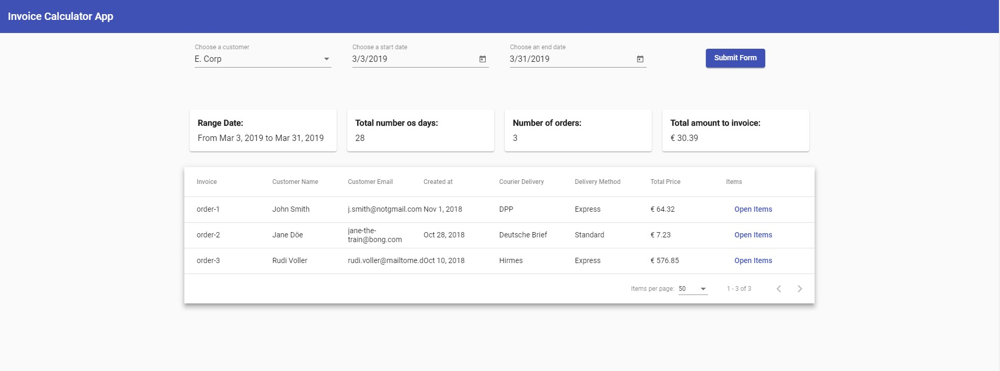

# InvoiceCalculatorApp

This project was generated with [Angular CLI](https://github.com/angular/angular-cli) version 7.3.3.

It's a SPA based on Angular version 7.2.0, it was choosed this tech stack because of the agility that Angular CLI provides, it's a great platform as a whole and based in the Invoice Calculator solution as well. It was used the latest good practices mentioned by Angular like `ngIf and Async Pipe`. It was implemented a simple approach of state persistence using some data through the URL that allows the user reload the app and still get the last data inputted.

## Development server

Run `ng serve` for a dev server. Navigate to `http://localhost:4200/`. The app will automatically reload if you change any of the source files.

## Code scaffolding

Run `ng generate component component-name` to generate a new component. You can also use `ng generate directive|pipe|service|class|guard|interface|enum|module`.

## Build

Run `ng build` to build the project. The build artifacts will be stored in the `dist/` directory. Use the `--prod` flag for a production build.

## Running unit tests

Run `ng test` to execute the unit tests via [Karma](https://karma-runner.github.io).

## Further help

To get more help on the Angular CLI use `ng help` or go check out the [Angular CLI README](https://github.com/angular/angular-cli/blob/master/README.md).
